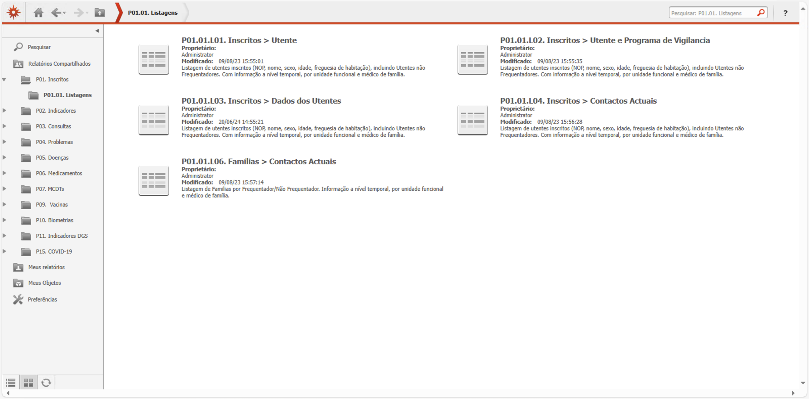

# O que é o MIM@UF?

O **MIM@UF** é uma plataforma de extração de dados desenvolvida para apoiar o trabalho nas unidades funcionais dos cuidados de saúde primários. Permite aceder a muitos dos dados gerados no dia-a-dia da unidade — de forma organizada, acessível e com um nível de detalhe que chega até ao utente.

O **MIM@UF** é particularmente útil para:
    - **Projetos de investigação**
    - **Auditorias**
    - **Trabalhos de governação clínica**,
    - **Currículo para internato e grau de consultor**
    - **Estudo de lista**

Em vez de andar a fazer registos manuais, o **MIM@UF** oferece uma solução sistematizada, fiável e reprodutível, à escala da unidade.

## De onde vêm os dados?

Os dados vêm de várias fontes, como o **SClínico**, a **PEM**, e plataformas de indicadores e vacinação. A atualização depende do tipo de dado: pode variar entre 1-2 meses até estar disponível quase em tempo real.

O acesso é feito através da **intranet** do centro de saúde ou da ULS. Existem diferentes **perfis de utilizador** — Médico, Enfermeiro e Interno — e o conteúdo disponível varia ligeiramente conforme o perfil. Neste tutorial, vamos explorar a plataforma com o perfil **Médico**.

Apesar de a plataforma já estar em funcionamento há vários anos, os relatórios continuam a poder sofrer atualizações. Por isso, este tutorial refere-se especificamente à versão em uso em 2025.

## Como está organizado o MIM@UF?

O **MIM@UF** está estruturado num sistema de pastas **módulos** uma destas pastas foca-se num tipo de dados ou função específica. Às vezes basta uma tabela para o que queremos saber. Outras vezes, temos de ir buscar dados a diferentes sítios e cruzar várias tabelas para obter a informação completa.

Ao entrar, por exemplo, no módulo dos P01. Inscritos, podemos explorar os vários tipos de elementos dentro do **MIM@UF**.

Há 4 elementos possiveis:

- **Pastas** (icon de pasta)
- **Gráficos** (contém letra **G** no nome e um ícone de gráfico)
- **Relatórios** (contém letra **R** no nome)
- **Listagens** (contém letra **L** no nome habitualmente dentro da pasta **Listagens**)

Embora o **MIM@UF** tenha alguns gráficos integrados (como a clássica pirâmide etária), estes têm poucas opções de personalização. O verdadeiro valor está nos **relatórios** e nas **listagens**, que nos dão mais liberdade para exploração e cruzamento de dados.

O nome de cada opção têm varias informações: onde está localizado, que tipo de elemento e um título descritivo.

> No caso do elemento **P01.01.L03. Inscritos > Dados dos Utentes**, localiza-se no Módulo P01 (Inscritos), pasta P01.01 (Listanges), tem um "L", portanto é uma listagem e pelo título terá alguma informação relativo a dados dos utentes.

## Relatório ou Listagem?

Tudo depende da **pergunta** que queremos responder:

> Se a nossa pergunta começa por **QUANTOS?** (ex: Quantos utentes...?, Quantos medicamentos?, Quantos doentes?) --- então escolhemos um **RELATÓRIO**.
> Se a nossa pergunta começa por **QUEM?** (ex: Quem são os utentes...?, Quem tem diabetes?, Quem tem resultados de HbA1c?, A quem foi prescrito insulina?) --- então escolhemos uma **LISTAGEM**.

## Começar com perguntas

A melhor forma de usar o **MIM@UF** é pensar em perguntas especificas. Alguns exemplos simples de perguntas que podem ser respondidas com o MIM@UF:

- Quantos agregados familiares tenho na minha lista? E quantos membros por agregado?
- Quais as nacionalidades, profissões e habilitações das pessoas inscritas?
- Quais os resultados dos indicadores por equipa?
- Quem não está a cumprir determinados indicadores?
- Quem teve consulta no último trimestre e que tipo de consulta foi?
- Quantas consultas fiz no 1.º semestre deste ano?
- Qual é o “TOP” de diagnósticos na minha lista de problemas?
- Quantos novos diagnósticos fiz no último trimestre?
- Quem tem diagnóstico de HTA?
- Que comorbilidades têm os utentes com HTA?
- Que medicamentos tenho prescrito?
- Qual o valor mais recente da TA ou da HbA1c de cada utente?

Se quisermos ir mais longe, é possivel fazer analises mais complexas como, que necessitam de extração de várias tabelas e cruzamento:

- Fazer uma lista completa de problemas por utente da unidade toda ou dos utentes que consultei
- Calcular a taxa de filtração glomerular dos utentes todos
- Calcular o **SCORE2** para toda a unidade
- Realizar auditorias de indicadores e isolar diferentes tipos de não cumpridores 
- Analisar de número de pedidos receituários por utente
- Analisar custos de MCDTs e/ou Medicamentos

## Conclusão

O verdadeiro poder do **MIM@UF** está na capacidade de transformar perguntas em conhecimento. É esse processo que nos ajuda a entender a prática clínica de forma mais profunda e a promover melhorias sustentadas e informadas.
