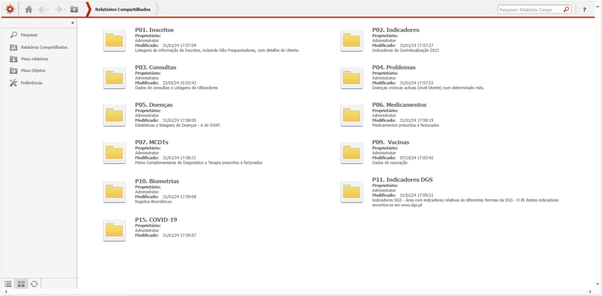

# Introdução

Muito bem, então o que é o MIMUF?

O MIMUF é uma plataforma de extração dos dados que são gerados durante a actividade de uma unidade funcional dos cuidados de saúde primários.

Permite ter acesso a dados relativamente abrangentes e com granularidade até ao utente, útil para trabalhos de investigação, projetos, auditorias, governação clínica, construção do currículo para o internato ou grau de consultor. É uma solução com dados à escala da unidade, eficiente e reprodutível, quando comparado a um registo manual tradicional.

Os dados vêm de várias fontes, como o SClinico, a PEM, e de plataformas com os dados de indicadores e vacinação. A maior parte encontra-se actualizado entre 1-2 meses até ao próprio dia, dependendo do tipo de dados.

Pode-se ACEDER na INTRAnet do centro de saúde ou da ULS. Há vários perfis de acesso, como Médico, Enfermeiro e Interno, que diferem principalmente nos módulos disponíveis. Vou utilizar o perfil Médico, pois é o mais completo e relevante para o propósito.

<iframe src="https://www.youtube.com/embed/n3k-dIykQaw" frameborder="0"></iframe>

<!-- <iframe src="videos/Timeline_1.mp4" frameborder="0"></iframe> -->

O MIMUF está organizado num sistema de pastas, sendo que estas pastas principais vou-lhes chamar de módulos

*[IR PARA PASTA P01. INSCRITOS]*

Os graficos que o mimuf disponibiliza são relativamente basicos e limitados. Este, por ecxemplo permite fazer uma piramide etária rapidamente, mas estamos limitados na no tipo de dados e no estilo. Portanto, os relatórios e as listagens costumam ser mais interessantes

A escolha entre relatórios e listagens depende da pergunta que estamos a responder
Se queremos saber "Quantos utentes estão insctritos", então escolhemos um relatório
Se queremos saber "QUEM são os utentes inscritos" então escolhemos uma listagem

Ao entrar dentro desta pasta podemos ver que existir 3 tipos de opções: **Relatórios** e **Listagens** e **Gráficos**. Cada um destes responde a perguntas diferentes.

Se queremos um gráfico pré feito, então naturalmente escolhermos o grafico, que está reperentado por este icon sugestivo, ou por este **G** no nome. Este aqui disponibiliza uma primamide etária. São uma foma rapida mas relativamente limitada de extrair informação.

Os mais interessantes são os relatórios e as listagens.

Se a nossa pergunta for: "QUANTOS utentes estão inscritos na unidade?", então escolhemos um **Relatório**. Estão representados pela letra **R** no nome. Se a pergunta for "QUEM são os utentes inscrtios na unidade?" então temos de escolher uma **Listagem**, e ai abrimos *[IR PARA PASTA P01.01 LISTAGENS]* esta pagina e temos várias opções de listagens, todas com **L** no nome.

Vamos experimentar ver quantos utentes estão inscritos na minha lista:

*[Exemplo de uma query: Número de inscritos]*

--- *[VOLTAR PARA O MENU PRINCIPAL]*

Assim, podemos pensar sob a forma de pergunta sempre que queremos utilizar o MIMUF.
E é aqui que começamos a descobrir as potencialidades, porque podemos fazer muitas perguntas

Por exemplo:

- Quantas agregados familiares tenho na minha lista e quantos membros?
- Quais as nacionalidades, profissão e habilitações profissionais da minha lista/unidade?
- Quais os resultado dos indicadores por equipa
- Quais são os não cumpridores de determinados indicadores
- Quem teve consulta no último trimestre, por tipo de consulta?
- Quantas consultas fiz no 1º semestre deste ano?
- Qual o TOP de diagnósticos da lista de problemas da minha lista ou unidade
- Quantos novos novos diagnósticos foram feitos no ultimo trimestre
- Quem tem diagnóstico de HTA
- Que comorbilidades tem os utentes com HTA
- Que medicamentos prescrevi
- Quais o valor mais recente de TA por utente
- Qual o último valor de HbA1c

Ou então tarefas mais complexas, que após extração de várias listas e processamento, podemos:

- Lista de problemas completa de dos utentes
- Calcular a taxa de filtração glomerular
- Calcular o SCORE2 da unidade toda unidade
- Auditorias de indicadores
- Analise de utentes pedem muitos receituários
- Analise de custos de MCDTs e Medicamentos

Estas perguntas permitem entender o que está a acontencer e desenhar estratégias para mudar procedimentos e pratica clínica com base em dados.

Espero que esta série seja útil. No próximo video vou falar de técnicas de extração de dados dentro do MIMUF, que são as bases para conseguir navegar eficazmente nesta plataforma
