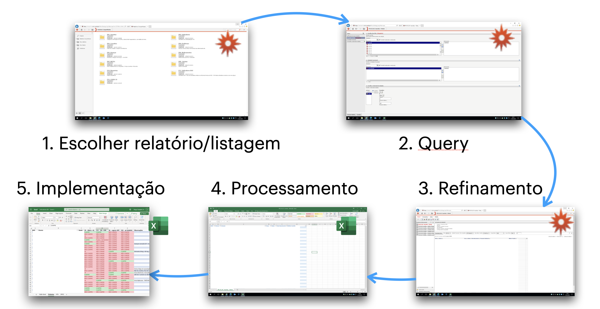

# Workflow

O processo de extrair dados do **MIM@UF** pode ser dividido em vários passos, pelo que proponho o seguinte workflow:

1. Primeiro temos de escolher o **relatório ou listagem** que se adapta mais a pergunta que queremos responder. Se não conhecemos o MIM@UF, os títulos e descrições dos relatórios são uma ajuda

2. Ao clicar no relatório/listagem que escolhemos, aparecenos uma interface para fazer o pedido de dados à base de dados. Este processo chama-se uma **Query** ou Prompt. É neste passo que introduzimos informação relevante para o pedido

3. Depois de executar a Query, aparece uma nova janela, onde temos acesso a uma primeira versão dos dados, habitualmente em forma de tabela. Nesta fase podemos **Refinar** a tabela de acordo com a nossa necessidades: retirar ou selecionar filtros, adicionar ou remover colunas, fazer algum tipo de limpeza dos dados.

4. Contentes com a tabela, vamos menu de **exportação**, em que podemos selecionar formato do ficherio, de forma a ser lido nos programas de processamento (Excel, python...)

5. No fim, abrimos o ficheiro num prgrama para fazer o processamento final. É neste passo que fazemos a transformação destes dados em tabelas ou graficos úteis para responder à nossa pergunta inicial.

Todas estas etapas têm truques e especificidades que, quando bem utilizados, permitem que sejamos mais rápidos nas extrações ou a aceder a mais dados que à primeira vista não aparecem.

---

## Como está organizado o MIM@UF?

O **MIM@UF** está estruturado num sistema de pastas **módulos** uma destas pastas foca-se num tipo de dados ou função específica. Às vezes basta uma tabela para o que queremos saber. Outras vezes, temos de ir buscar dados a diferentes sítios e cruzar várias tabelas para obter a informação completa.

Ao entrar, por exemplo, no módulo dos P01. Inscritos, podemos explorar os vários tipos de elementos dentro do **MIM@UF**.

Há 4 elementos possiveis:

- **Pastas** (icon de pasta)
- **Gráficos** (contém letra **G** no nome e um ícone de gráfico)
- **Relatórios** (contém letra **R** no nome)
- **Listagens** (contém letra **L** no nome habitualmente dentro da pasta **Listagens**)

Embora o **MIM@UF** tenha alguns gráficos integrados (como a clássica pirâmide etária), estes têm poucas opções de personalização. O verdadeiro valor está nos **relatórios** e nas **listagens**, que nos dão mais liberdade para exploração e cruzamento de dados.

O nome de cada opção têm varias informações: onde está localizado, que tipo de elemento e um título descritivo.

> No caso do elemento **P01.01.L03. Inscritos > Dados dos Utentes**, localiza-se no Módulo P01 (Inscritos), pasta P01.01 (Listagens), tem um "L", portanto é uma listagem e pelo título terá alguma informação relativo a dados dos utentes.

---

## Relatório ou Listagem?

Tudo depende da **pergunta** que queremos responder:

- Se a nossa pergunta começa por **QUANTOS?** (ex: Quantos utentes...?, Quantos medicamentos?, Quantos doentes?) --- então escolhemos um **RELATÓRIO**.
- Se a nossa pergunta começa por **QUEM?** (ex: Quem são os utentes...?, Quem tem diabetes?, Quem tem resultados de HbA1c?, A quem foi prescrito insulina?) --- então escolhemos uma **LISTAGEM**.

> A diferença entre Relatório e Listagem é que o Relatório nos dá um número de utentes ou eventos, enquanto a Listagem nos dá uma lista de utentes ou itens

À medida que vamos utilizando o MIM@UF, vamos aprendendo a identificar os relatórios e listagens que mais se adaptam às nossas necessidades. Muitas vezes, um relatório/listagem tem mais potencialidades do que aparece na descrição, e é possível fazer extrações mais complexas do que o nome sugere.
