# Query

Depois de escolher o relatório ou listagem que nos parece mais apropriado para a nossa pergunta, a **Query** é o passo seguinte que nos permite fazer instrução para o pedido de dados inicial ao MIM@UF.

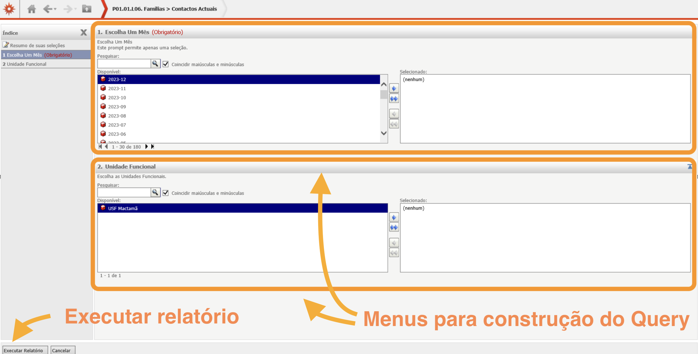

> Habitualmente a seleção faz-se passando a opção das caixas da esquerda para a direita e o botão para executar a query encontra-se no canto inferior esquerdo. Se faltar agluma coisa ao executar a query, o MIM@UF dá erro e diz o que falta.

Nos vários menus de seleção da query tem uma interface com cubos e setas que movem os cubos. Os cubos vermelhos são as verdadeiras opções de seleção, e os cubos amarelos são pastas de cubos

De seguida mostrar os diferentes tipos de menus possíveis para a execução de uma Query, e como os utilizar corretamente.

---

## Unidade Funcional

Começamos pela a unidade Funcional.
Este é fácil, é só escolher a nossa unidade. Nem sempre aparece mas quando aparece é só passar para o lado esquerdo e está feito.

---

## Escolha temporal

A escolha temporal é essencial na elaboração da Query, uma vez que o tipo de dados do mimuf tem sempre alguma referencia a tempo. Os queryes oidem ter uma de duas opções de seleção de tempo

- **data**
- **periodo de tempo**

Quais as diferenças de **data** e o **periodo de tempo**?

> A **data** (habitualmente através das escolha de um mês) quando o relatório proporciona **"fotografia"** de um momento específico, habitualmente são dados que mudam apenas mensalmente, que ser por exemplo para ver a lista de utentes inscritos ou resultados de indicadores. Outro exemplo em que visão "fotografia" se aplica são resultados de MCDTs ou biometrias, onde o MIM@UF nos dá o valor mais recente registado à data da "fotografia".

Na data é permitida a seleção de apenas de um mês.

> O **periodo temporal**  faz sentido quando a informação que procuramos acontece com registos com elevada frequência, como por exemplo consultas ou prescições de MCDTs e medicamentos, que acontecem dezenas a centenas de vezes por dia. Então escolhemos uma **janela de tempo** na qual queremos fazer a analise.

Num periodo temporal pode ser feita uma seleção simples de um ano, semestre, trimestre ou um mês, ou então, uma seleção composta, como com vários meses, ou trimestres que não precisam de ser consecutivos.

### Especificidades/excepções das escolhas temporais

Habitualmente o **MIM@UF** apresenta-nos uma interface adequada ao tipo de referencia temporal que o relatório permite, mas nem sempre. Por exemplo, logo no primeiro relatório de todos, no **P01.R01. Inscritos > Sexo e Grupo Etário** a interface que nos aparece é de um periodo temporal, embora o que faça sentido seja uma data (ou seja, um mês).

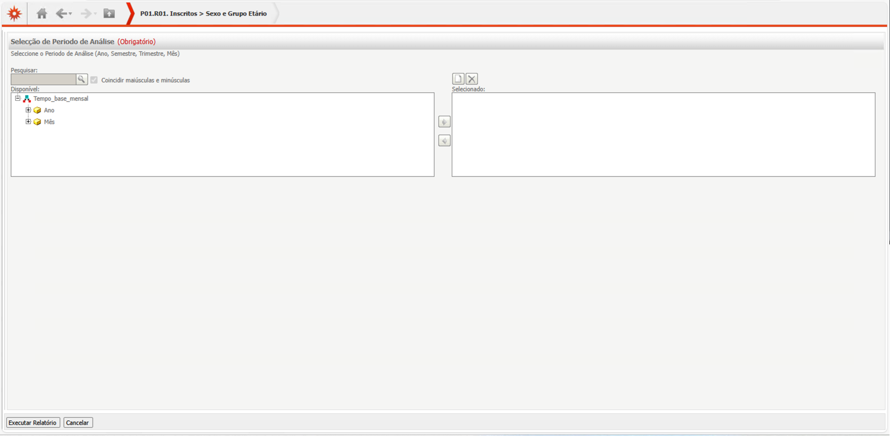

Imaginemos que o nosso centro de saude cerca de 10.000 utentes inscritos selecionarmos ano no periodo temporal, o **MIM@UF** vai nos dar o somatório de todos os meses, ou seja, cerca de 120.000 utentes inscritos. Isto não faz muito sentido. Se colocarmos só um mês já dá valores corretos. Assim, apesar do menu deste relatório menu permita selecionar periodos temporais, num contexto de contagem de inscritos o que faz sentido é uma data pelo que devemos optar por um mês

O contrário também pode acontecer, o relatório só deixar escolher um mês de cada vez, e se temos o azar de querermos um periodo de 1 ano, temos de repetir a extração do relatório 12 vezes, um para cada mês...

Um exemplo o relatório **P04.R07. Novos Problemas > Sexo e Grupo Etário**. se queremos tirar os Novos problemas diagnosticado ao longo do ano, temos de tirar 1 mês de cada vez...

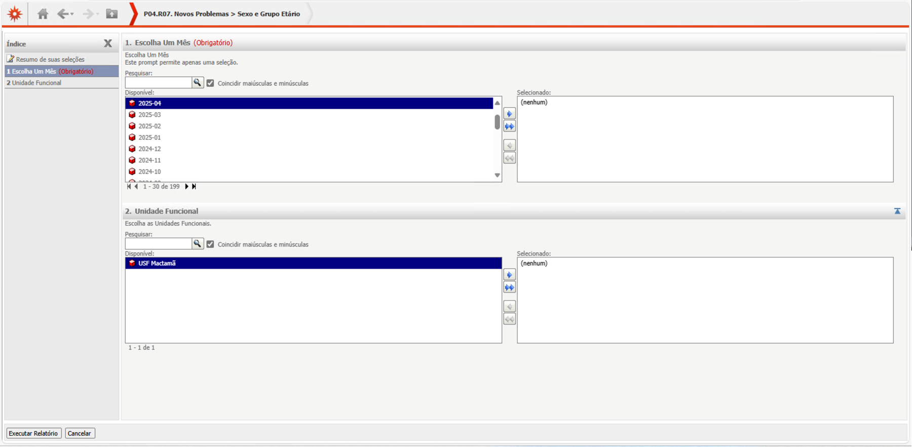

Ha ainda outra variante: há relatórios em que, podendo extrair 1 ano duma só vez, não é boa ideia. Isto acontence quando a quantidade de dados de 1 ano é tão grande que, ou o **MIM@UF** demora uma eternidade a executar o query, ou o query é executado mas depois não dá para exportar por ser tão grande.

Isto acontece, por exemplo, se tentarmos obter as nas listagens de medicamentos prescritos de todos os médicos durante um ano (**P06.01.01.L03. Listagem de Medicamentos Prescritos por Utente - Marca e DCI**), em que facilmente pode resultar numa tabela com 100.000 linhas.

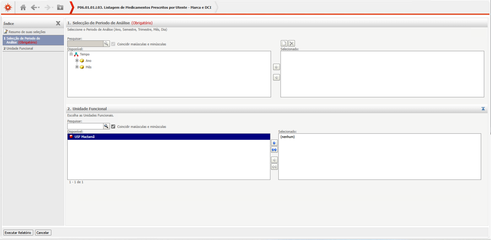

A solução é partir o elefante às fatias. Experimenta-se com 1 ano, se não funcionar então faz-se em semestres ou trimestres, e junta-se à posteriori.

---

## Ano contratual

Nas queries referentes a **indicadores** é costume pedir o ano contratual. Este também é muito simples. Basta selecionar o ano referente aos indicadores que queremos analisar. Por definição nunca vem com o ano correto, portanto é preciso mudar sempre para o correspondente.
Está feito!

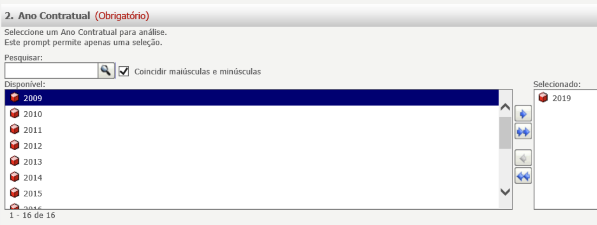

---

## Indicadores e Grupo de indicadores

Ainda nos indicadores, se executarmos a query é costume aparecer um segundo menu com seleção e indicadores ou grupo de indicadores.

Existe uma barra de pesquisa permite encontrar os indicadores pelo ID ou pelo nome. Habitualmente estão disponíveis mais de 200 indicadores.

> **Podem ser selecionados até 10 indicadores ao mesmo tempo**, que nos pode poupar tempo quando queremos fazer uma analise mais abrangente dos indicadores.

Cuidado a escolher entre FX e FL - respetivamente, fixo e flutuante. E alguns dos indicadores apenas têm uma das versões disponíveis.

### Como escolhemos entre flutuante e fixo?

Depende do tipo de analise que queremos fazer com os indicadores

> O **flutuante** serve para ver estado atual do cumprimento, ou seja, permite perceber se as as estratégias implementadas estão estão ou não a ter resultados.

> O **fixo** permite projetar qual será o cumprimento do indicador no final do ano. É útil para descobrir utentes que serão futuros não cumpridores se nada acontecer.

Vamos usar o exemplo do indicador 37 - **Proporção de utentes com diabetes com consulta de enfermagem no último ano**

Assumindo que estamos em maio, os cumpridores deste indicador pelo flutuante tiveram pelo menos uma consutla de vigialncia de diabetes de enferamgem nos ultimos 12 meses: portanto, entre maio deste ano e junho do ano anterior.

Se virmos o fixo do mesmo indicador, só serão cumpridores quem teve a mesma consulta de vigilancia a partir de 1 de janeiro deste ano.

Ou seja, **se um utente for cumpridor no flutuante e incumpridor no fixo**, pode significar que habitualmente ele costuma ser cumpridor (o ano passado foi) mas ainda não teve a consulta este ano (pode já estar marcada ou não, mas isso não sabemos pelo indicador...)

Naturalmente, se tirarmos este indiacador fixo em janeiro, o quase todos os utentes serão não cumpridores, porque a maior parte ainda não teve oportunidade de ter consulta.

Por outro lado tirando em dezembro, o fixo e o flutuante devem ser exatamente iguais. No fim, o flutuante e o fixo complementa-se: o primeiro mostra o estado actual, o segundo é util para planeamento.

*Nota:* não esquecer que o resultado dos indiadores no **MIM@UF** costumam ter 1 a 2 meses de atraso)

Boa, voltamos ao **MIM@UF**. Outro menu referetes a indicadores é o grupo de indicadores.

Neste caso é relativamente simples, porque por definição estão todos selecionados. Raramente é necessário mudar, portanto é avançar sem fazer nada.

---

## ICPCs

Vamos à escolha de ICPCs

Apesar da interface parecer realtivamente linear, não é muito prático escolher para encontrar o que queremos rapidamente, especialmente porque a ferramenta de pesquisa não fuinciona aqui e a solução aparente é andar a navegar numa lista de 1500 diagnósticos diferentes com setinhas. Hell no!

Vou explicar como fazer isto muito mais rápido:

1. Inicialmente escolher o primeiro código que nos aparecer dentro da pasta dos ICPC, pode ser  o *-1:NE*, *A:GERAL E INESPECIFICO* ou *A01:DOR GENERALIZADA / MÚLTIPLA* e selecionar para a caixa da direita, não interessa qual

2. Depois, na caixa da direita, clicamos no código selecionado, que faz aparecer uma janela onde agora sim, já temos um campo de pesquisa por nome ou código ICPC

3. Removemos o código inicial com auxilio da seta

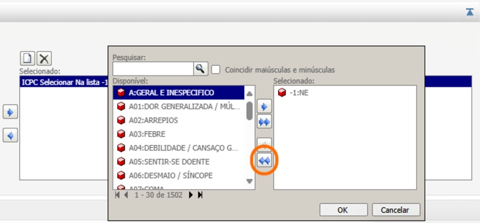

4. Selecionamos o código ou códigos que queremos (por exemplo hipertenção - K86 e K87) com a ajuda da pesquisa, e adicionamos à caixa da direita com as setas.

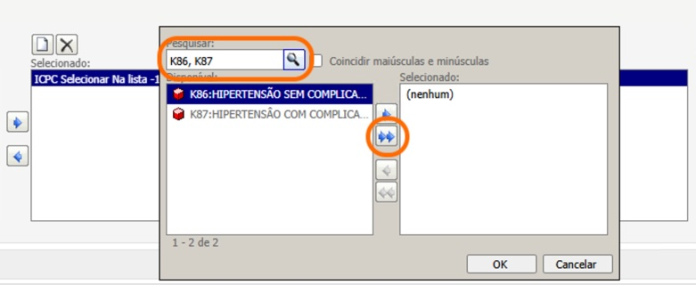

5. Ok para confirmar a seleção.

6. E de forma rápida conseguimos selecionar os ICPCs que queremos, sem ter de andar a navegar por uma lista gigante.

Nos relatórios que permitem ver comorbilidades têm 2 sitios diferentes para ICPCs, ICPC1 e ICPC2. Funcionam ambos da mesma forma, podemos colocar um ou vários códigos ao mesmo tempo.

Pode-se selecionar multiplos ICPCs ao mesmo tempo, com duas nuaces impotantes:

- Há alguns relatórios não permitem a distinção no caso ter sido selecionado mais do que um ICPC

- Não há propriamente um limite de número maximo de ICPCs que se podem selecionar, mas se a tabela gerada for muito grande, o **MIM@UF** pode não conseguir exportar os dados. Neste caso, é necessário reduzir o número de ICPCs selecionados.

---

## MCDTS e área de MCDT

Para os relatórios referentes a Prescrição ou resultados de MCDTs, habitualmente é necessário escolher a àrea de MCDT ou o MCDT espeficico na Query.

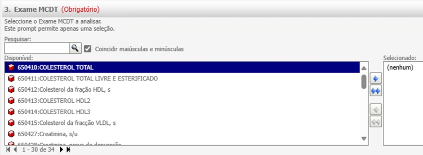

Por exemplo, quando queremos resultados de Colesterol total temos de encontrar código certo nesta interface se pesquisar por colesterol (tenho de retirar este tick de maiusculas e minusculas), vemos que há vários tipos de colesterol repetidos...

Aqui temos que ir por tentativa e erro, pois depende do codigo de prescrição e da forma exame ficou registado no SClinico, que pode variar entre centros de saúde e entre laboratórios. Para agravar as coisas, só podemos selecionar um de cada vez.

Aqui também podemos tirar o LDL, mas queria deixar uma nota: dependendo outra vez dos hábitos de prescrição e registo de cada centro de saúde e laboratório, pode ser necessário tirar também o Colesterol total, HDL e Triglicéridos. Isto porque há laboratórios que calculam o LDL a partir do perfil e migra para o SClinico, outros não, e se calcularmos nós à posteriori o LDL a partir do perfil lipido com a formula de Friedewald, garantido que valores são referentes à mesma data de registo, aumentamos a rede e apanhamos mais LDLs.

Quando falamos de listagens de prescrição de MCDTs, a forma de escolher é por àrea de MCDT.

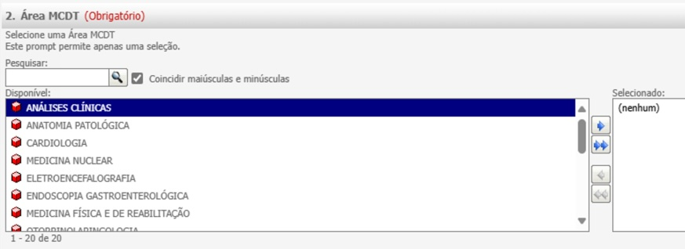

Neste caso, se queremos as prescrições de MCDTs por utente de todas as areas temos de fazer 1 a 1. Mas se apenas precisamos saber contagens, o relatórios já não têm essa limitação.

---

## Biometrias

As biometrias funcionam de forma muito parecida aos MCDTs.

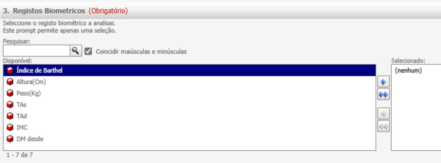

Uma novidade recente é que também já dá para tirar o indice de BARTEL que tenha sido registado no SClinico. e o DM deste e o registo a data de diagnóstico de DM, que é muito util para caracterização de diabeticos no curriculo ou para o calculo de SCORE 2 dad diabetes. Ainda assim Este menu permite apenas 1 seleção de cada vez.

---

## Menus especiais

Existe ainda menus especifícos que permitem adicionam filtros ou seleção de metricas ainda na query, mas não têm grande utilidade. Ainda assim, é necessário fazer uma seleção para poder avançar com a query

### Filtros

Um exemplo de filtro é na listagem P01.01.L01 de inscritos onde paraece uma seleção de intervalo de idades.

Por definição o **MIM@UF** seleciona este filtro mas na realidade vai introduzir limitações indesejadas, pelo que sugiro sempre alterar para -nenhum-

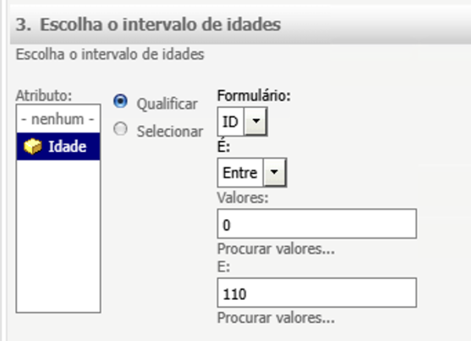

### Métricas

Outro exemplo é nos TOP de faturação de MCDTs (**P07.02.R03. TOP MCDTs Aceites > Médico**) ou Medicamentos (**P06.02.R03. TOP Medicamentos Aceites > Médico**), onde aparece um menu para escolher qual metrica utilizar para ordenar o TOP. No fim vamos ter acesso a todas as metricas, portanto não é dramático esta seleção.

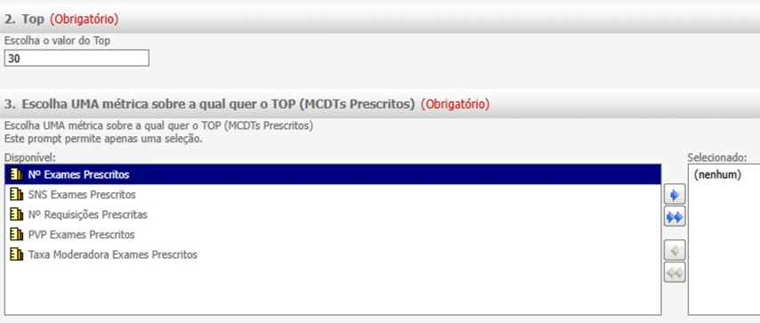

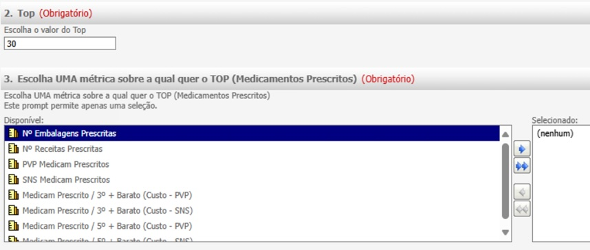

Nas Biometrias (**P10.01.L01. Resultados Biométricos > Utente**) também existe uma seleção do tipo de resultado com possibilidade de adicionar filtros. Costumo não selecionar, uma vez que prefiro obter os dados todos e filtrar depois do que aplicar um limite à partida.

