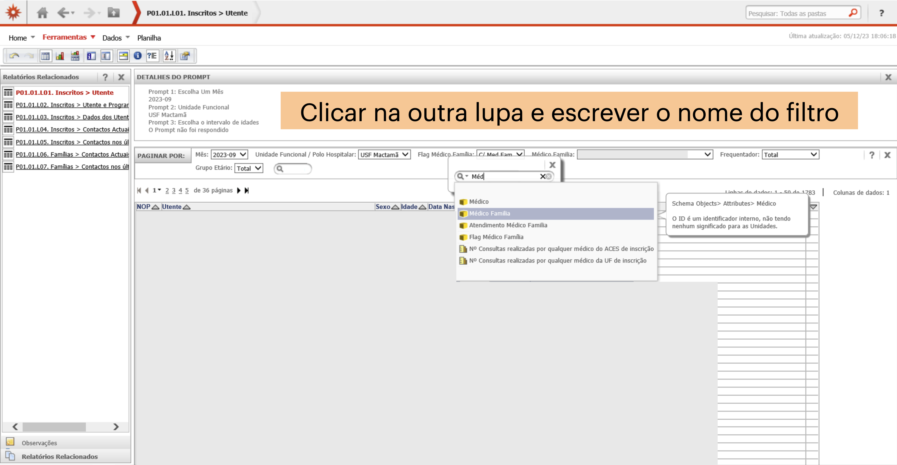

# Refinamento

Depois da Query, o MIM@UF apresenta-nos o resultado sob a forma de uma tabela, com opções para a podemos modificar. É nesta fase que podemos refinar os dados, filtrando, ordenando e transformando a tabela de acordo com as nossas necessidades.

> É aqui que residem as maiores potencialidades do MIM@UF que desbloqueiam várias funções de manipulação de dados, mas que não são imediatamente aparentes à primeira vista.

Imaginemos que queremos a minha lista de utentes inscritos para isso podemos utilizar o relatório **P01.01.L01 Inscritos**

Ao executar a query obtemos uma tabela em que cada linha é um utentes e várias colunas com dados de cada utente como o sexo e a idade.

---

## Barra do topo

Nesta secção o superior com 4 menus, sendo que se clicarmos em cada um a barra por baixo vai-nos mostrar opções diferentes: Home, Ferramentas, Dados e Planilha.

Os botões mais importantes são do menu **Home** são:

- **Exportar**: permite exportar a tabela
- **Novo Prompt**: permite voltar atrás à query mas ainda com as escolhas da query ainda preenchidas, útil para fazer uma nova query com pequenas alterações (tipicamente mudar o mês, MCDTs ou ICPCs), em vez de voltar a fazer tudo de novo.

No menu **Planilha**:

- **Mesclar cabeçalhos de colunas** e **Mesclar cabeçalhos de linhas**: permitem unir ou separar células que estão unidas, o que é útil para quando existem celulas unidas, permitindo evitar formatação desnecessária e tornar a tabela mais facil de trabalhar em processamento.

---

## Detalhes do Prompt

Metadados da query. Informação que pode estar presente no ficherio final se na exportação escolhermos incluirmos os metadados. É uma informação que pode ser útil para percebermos o que é que estamos a ver, e que nos pode ajudar a identificar o relatório.

---

## Barra dos filtros

Por baixo temos o PAGINAR POR, que na realidade são filtros.

Estes são particularmente interessantes porque permitem manipular os dados de acordo com a nossa necessidade, especilamente porque o filtro escolhido por definição pode não ser o que queremos. Neste caso temos aqui vários filtros que temos de mudar no caso de queresmos a lista completa dos utentes da unidade toda.

Antes de começar a mudar filtros, gostava de mostrar alguns truques.

Uma forma de entender rapidamente de saber se os dados que temos estão adequados ou não é por esta secção à direita, entre os filtros e a tabela, onde diz quantas linhas tem a tabela.

Neste caso temos 64 linhas, sendo que uma linha corresponde a um utente. Significa de certeza não temos a listagem toda.

Outra forma de verificar é olharmos para a tabela e para os dados: na secção da idade vemos que temos apenas 0 a 4 anos e apenas tem os frequentadores, ou seja, não temos a lista completa de utentes.

Com estas duas pistas, podemos verificar que os dados não estão completos pelo menos relacionado com com estres filtros. Se alterarmos estes dois filtros para *TODOS* já ficamos com uma tabela com a lista completa de utentes para o Médico de Família selecionado.

---

## Filtro -> coluna

Agora imaginemos que queriamos a lista da Unidade toda. sem saber mais nada, significaria que tinhamos de tirar 10 vezes esta lista no caso do nosso centro de saude ter 10 medicos e depois juntar tudo no fim?

Era uma hipotese, mas há uma forma melhor: que é juntar todos os médicos na mesma tabela. Este é um dos truques mais poderosos que o MIM@UF permite, e que abre um mar de possibilidades.

Basicamente vamos transformar um dos filtros, neste caso Médico Familia, numa coluna:

1. Movemos o rato entre o nome de duas colunas e aparece esta linha vertical amarela e uma lupa.

2. Clicamos na Lupa

3. Aparece outra Lupa, clicamos nessa lupa e procuramos o nome do filtro que queremos tranformar para coluna - neste caso escrevemos *Méd*

4. Clicamos em Médico Familia

E vejam, o filtro desapareceu e reapareceu em coluna. Não só temos a lista de utentes do centro de saude inteiro como temos o nome do Médico de Família para cada utente!

Podemos fazer o mesmo com qualquer filtro, temos de ter cuidado em escrever e exatamente o nome do filtro

## Coluna -> filtro

O inverso também é possivel: podemos passar uma coluna para filtro. Basta escrever o nome da coluna no campo de pesquisa da barra de filtros e clicar.

---

## Tabelas de dupla entrada

A localização onde colocamos o rato para fazer a transformação de filtro para coluna também é importante, pois se colocarmos o rato depois da coluna **Métrica** (só funciona nas tabelas que têm uma coluna Métrica), em vez de criarmos uma nova coluna simples, criamos uma tabela de dupla entrada, que é uma tabela onde temos duas colunas de filtros, e cada célula é o resultado da combinação dos dois filtros. pode ser particularmente útil para ver a distribuição de dados entre duas variáveis.

