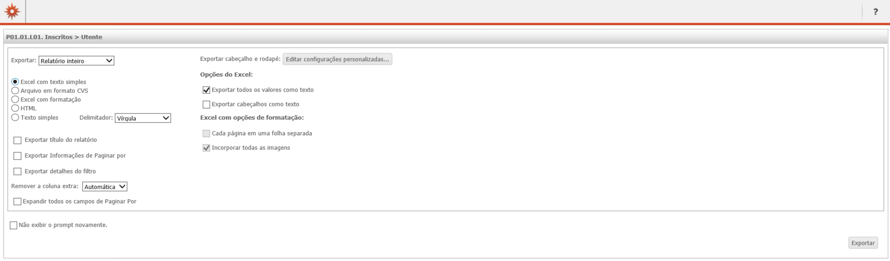
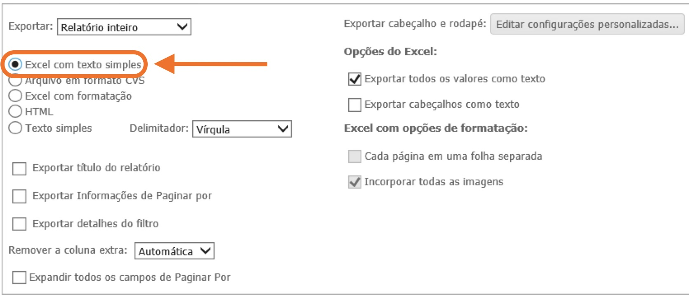
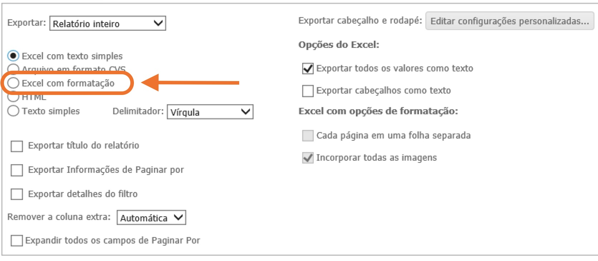
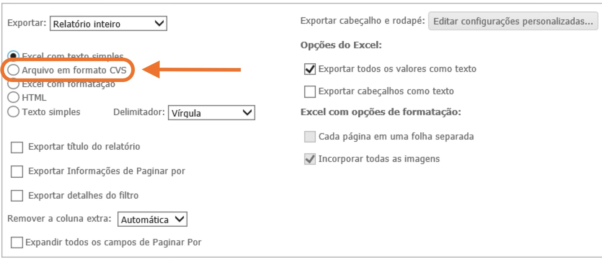
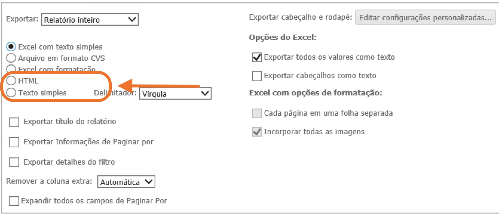
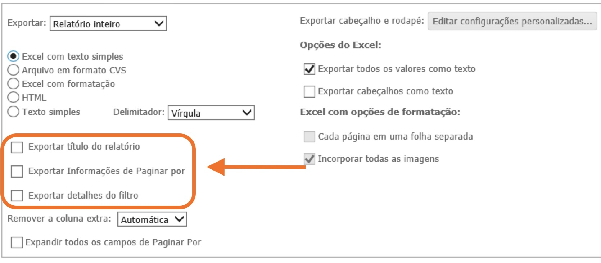
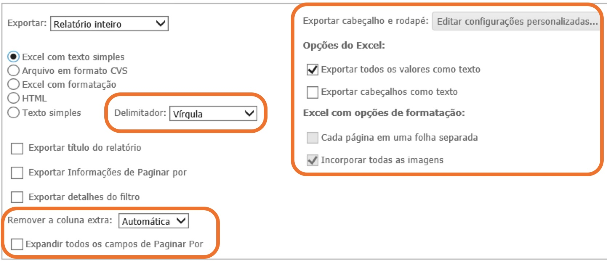

# Exportação

Para poder descarregar os dados que obtemos, podemos utilizar o botão de exportação no Home, na barra superior.

Este passo tem várias opções no que toca ao formato do ficheiro, bem como a inclusão ou não de metadados.

## Excel com texto simples e Excel com formatação

O formato Excel é bastante prático, mas infelizmente o MIM@UF permite apenas exportar num formato antigo .xls, pelo que para a correta leitura dos dados é necessário abrir o ficheiro com o Microsoft Excel e exportar novamente para o formato .xlsx/Livro. Portanto é necessário ter no nosso computador do Centro de Saúde o Microsoft Excel instalado.

Evenutualmente o LibreOffice também poderá funcionar, mas não testei.

Costumo usar a opção **Excel com texto simples**, não aprecio **Excel com formatação**, esteticamente datada.

## Arquivo em formato CSV

O CSV é um formato universal e simples e em teoria é um formato versátil, uma vez que pode ser lido por praticamente todas as aplicações de manipulação de dados. Ainda assim, não tenho o melhor experiencia com o formato especifico que o MIM@UF exporta, pelo que opto por exportar para Excel e depois converter para CSV já com Python, especialmente por habitualmente tenho tido mais facilidade em gerir os metadados pela via do Excel.

## HTML e Texto simples

Nunca experimentei. Não vejo potencial utilidade, mas são opções.

## Metadados

São as opções *Exportar título de relatório*, *Exportar informações de Paginar por* - aka os filtros - e *Exportar detalhes do filtro* - aka, a Query.

Esta informação é particularmente útil para à posteriori sabermos a origem dos dados e o que eles representam, até porque o título do relatório não é muito explicativo e quando extraímos dados em larga escala é fácil perdermos a noção do que cada ficheiro representa. Ainda assim pode haver situações onde é legítimo não incluir os metadados.

## Outras opções

Não costumo mudar as outras opções.

No caso de se querer modificar permanentemente das opções de exportações nas definições do MIM@UF é possível definir o *default*, que pode poupar cliques desnecessários.

