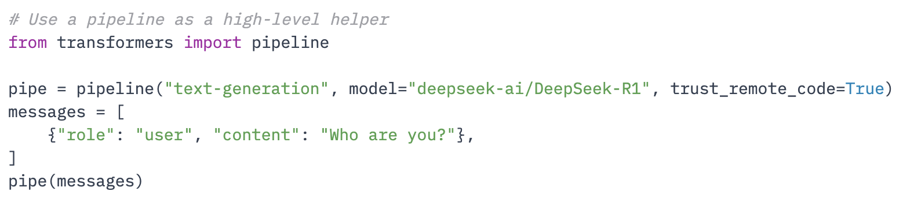

# Processamento

Tendo desenvolvido gosto por análise de dados e tendo desenvolvido competências de programação em Python, qualquer tabela que me apareça à frente leva com Pandas em cima :D

## Python

O **Python** resolve vários problemas duma vez só, pois permite:

- manipular dados muito eficiente e poderosa, especialmente com bibliotecas como o Pandas ou Polars. Com poucas linhas de código, podemos transformar e analisar dados em tabelas de forma reprodutível
- automatizar tarefas repetitivas, sem usar interfaces gráficas, poupando tempo e esforço
- integrar dados de diferentes fontes, cruzamentos complexos e executar cálculos em larga escala (SCORE2, TFG)
- criar visualizações de dados, como gráficos e dashboards, para facilitar a interpretação dos resultados, com as bibliotecas Matplotlib, Seaborn ou Plotly
- criar aplicações web simples para partilhar resultados e interagir com os dados, com as bibliotecas Streamlit ou Flask
- aplicar técnicas de machine learning com bibliotecas como Scikit-learn ou PyTorch, para prever resultados ou identificar padrões nos dados
- executar independentemente do sistema operativo, sem depender de software específico ou licenças, uma vez que é open source e multiplataforma

No entanto tem uma curva de aprendizagem mais acentuada, especialmente para quem não tem experiência prévia em programação. Mas não é nada que um assistente de AI não possa ajudar e hoje em muitas das bibliotecas existentes já facilitam a o processo com funções pré-definidas - basta dizer que é só precisamos de 5 linhas de código para importar por exemplo o modelo da DeepSeek e começar a utilizar a partir do [huggingface.co](https://huggingface.co).

Com o tempo e prática, a programação em **Python** torna-se uma ferramenta poderosa para qualquer profissional que queira explorar e analisar dados de forma mais eficiente e consistente.

## Excel

O velhinho **Excel** acaba por ser o *default* por ter um design grafico intuitivo, mas com funcionalidades avançadas incluidas. Para além disso, está instalado na maioria dos computadores. Tem a desvantagem de não ser tão eficiente para grandes volumes de dados ou análises complexas, mas é uma ferramenta muito versátil para manipulação de tabelas e cálculos simples.

Outras plataformas, como R e Microsoft Power BI, bem como outras linguas de programação, são também formas legitimas de fazer o processamento de dados.
